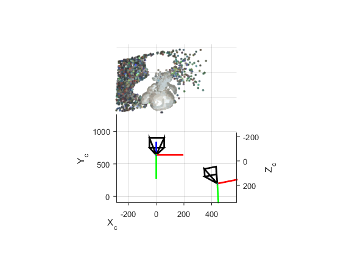

# Structured Light Toolkit

This toolkit implement a Gray-coded Structrued Light technique.

## Download
Clone this repository and get the data. The sources of datasets are specified in the corresponding README files

```
git clone https://github.com/imkaywu/SLKit
cd SLKit
```

## Demo
You can run the `slRecon.m` to get the reconstructed result.

## Result



## License
MIT