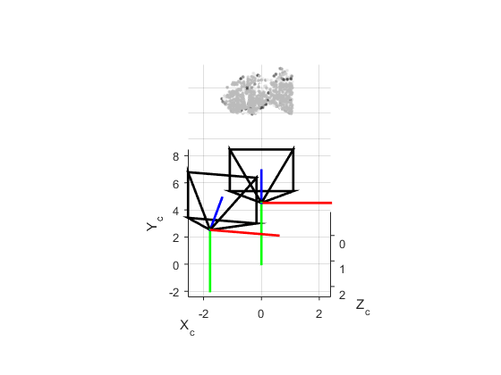

# Structured Light Toolkit

This toolkit implement a Gray-coded Structrued Light technique.

## Dependencies
- Matlab

## Download
Clone this repository and get the data. The sources of datasets are specified in the corresponding README files

```
git clone https://github.com/imkaywu/SLKit
cd SLKit
```

## Dataset
The images are named as `xxxx.abc`, where `xxxx` is a four number sequence starting from 0, and `abc` is the image format. The dataset contains objects imaged under column and row projection patterns. For each pattern, the inverse pattern is used to eliminate the error caused by inter-reflection. Two additional images with lights on and off are captured to ease the decoding process.

## Demo
You can run the `slRecon.m` to get the reconstructed result.

## Result



## License
MIT